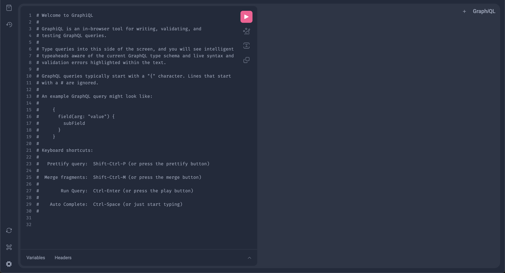

# laravel-nextjs-demo

## Setup Instructions

For the backend:
```bash 

cd backend 

touch database/database.sqlite

composer install

php artisan migrate --seed

php artisan lighthouse:ide-helper

php artisan serve
```


For the frontend:
```bash 
cd frontend 

npm install

npm run dev
```

## Graphql Dev Tools



Go to http://localhost:8000/graphiql